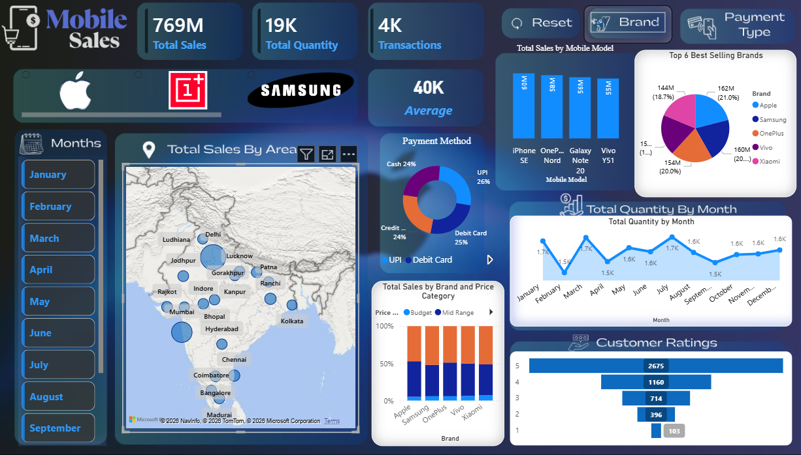
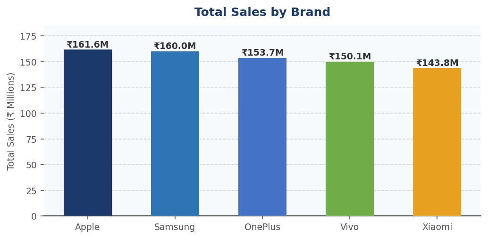
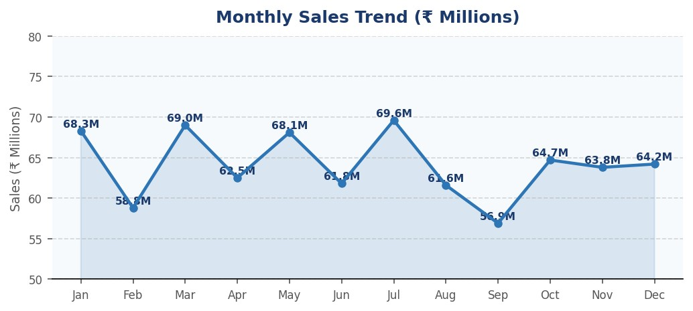
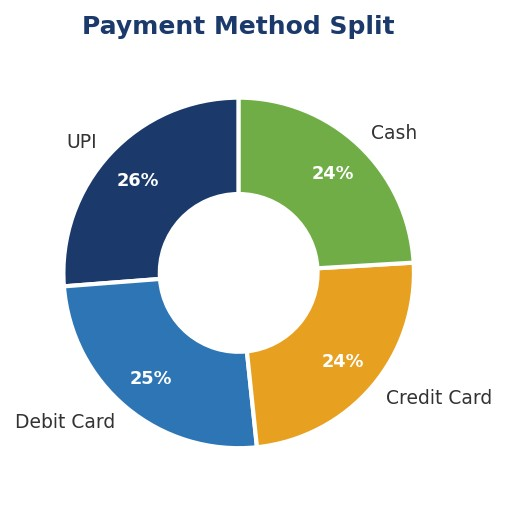

# 📊 Mobile Sales BI Insights Dashboard

An interactive **Power BI Business Intelligence Dashboard** built to analyze mobile sales data and generate meaningful insights using modern dashboard UI, slicers, bookmarks, and brand visuals.

---

## 🚀 Project Overview

This dashboard analyzes mobile sales across different brands, cities, customers, and price categories.

| Insights | Insights |
|---------|----------|
| Brand-wise sales performance | Units sold |
| Price category distribution | Customer demographics |
| Payment methods | Customer ratings |
| City-wise sales | Sales trends |

The dashboard is designed with a **modern glass UI style, custom icons, brand logos, and interactive filters.**

---

## 📊 Dashboard Preview

---

## ✨ Features

| Features | Features |
|----------|----------|
| ✔ Interactive slicers | ✔ Reset filters button |
| ✔ Brand logo integration | ✔ Dynamic visuals |
| ✔ KPI cards | ✔ Category analysis |
| ✔ Customer insights | ✔ Modern UI design |

---
##  📑 Business Intelligence & Deep Insights Report

## 1. Executive Summary

This report analyses mobile device sales data across India spanning 2021–2024, covering 3,835 transactions, five major brands (Apple, Samsung, OnePlus, Vivo, Xiaomi), 19 cities, 15 mobile models, and four payment channels.

|                     A                                    |                              B                              |
|----------------------------------------------------------|--------------------------------------------------------------|
|•  Apple leads in total revenue (₹161.6M)                 | •  Customers aged 46–60 contribute the highest sales volume|
|•  UPI dominates as the preferred payment method (26%)    | •  Majority ratings are 5★, but some low ratings require attention|
|•  Delhi accounts for 26.5% of national sales             | •  The total revenue stands at ₹769 million across approximately 19,150 units sold.|

---

## 2. Brand Performance Analysis

  

| Brand | Revenue (₹M) | Units Sold | Transactions | Avg Rating | Market Share |
|--------|------------|------------|------------|------------|------------|
| Apple | 161.6 | 3,932 | 783 | 3.71 ★ | 21.0% |
| Samsung | 160.0 | 3,923 | 775 | 3.70 ★ | 20.8% |
| OnePlus | 153.7 | 3,830 | 768 | 3.68 ★ | 20.0% |
| Vivo | 150.1 | 3,801 | 766 | 3.65 ★ | 19.5% |
| Xiaomi | 143.8 | 3,664 | 743 | 3.72 ★ | 18.7% |

### Key Insights

- Apple leads revenue but by a razor-thin margin over Samsung (₹1.6M gap) — brand dominance is highly contested.
- Xiaomi rates highest (3.72★) despite lowest revenue — a strong value-for-money perception.
- Market share is nearly equal across brands
- Revenue per unit is highest for Apple & Samsung, suggesting premium pricing is working.

---

## 3. Monthly Sales Trend

  

### Seasonality Insights

- July (₹69.6M) and March (₹69.0M) are peak months — likely tied to festive promotions and budget cycles.
- September (₹56.9M) is the weakest month — a strategic opportunity for targeted discounting.
- February and August also dip, forming a bimodal low-demand pattern worth monitoring.
- Strong Q1 and Q3 performance

---

## 4. Payment Methods & Geographic Distribution

  

>

| Payment Method | Transactions | Revenue (₹M) | Share |
|--------------|-------------|-------------|--------|
| UPI | 1,011 | 201.7 | 26.2% |
| Debit Card | 948 | 195.7 | 25.4% |
| Credit Card | 947 | 186.7 | 24.3% |
| Cash | 929 | 185.1 | 24.1% |

### Insights

- UPI leads with ₹201.7M in revenue — digital payments are firmly mainstream in Indian mobile retail.
- Delhi highest revenue city
- Cash remains relevant at 24.1% — non-digital customers in Tier 2 cities should not be overlooked.
- Tier-2 cities show growth potential

---

## 5. Top Performing Mobile Models

| Rank | Model | Brand | Revenue (₹M) | Insight |
|------|-------|--------|------------|----------|
| 1 | iPhone SE | Apple | 59.6 | Affordable Apple |
| 2 | OnePlus Nord | OnePlus | 57.9 | Value flagship |
| 3 | Galaxy Note 20 | Samsung | 56.0 | Premium |
| 4 | Vivo Y51 | Vivo | 54.8 | Budget leader |
| 5 | Galaxy S21 | Samsung | 53.3 | Premium |
| 6 | iPhone 11 | Apple | 51.5 | Evergreen |
| 7 | Galaxy A51 | Samsung | 50.8 | Mid range |
| 8 | iPhone 12 | Apple | 50.5 | Flagship lite |
| 9 | Vivo V20 | Vivo | 49.7 | Camera focus |
| 10 | Mi 11 | Xiaomi | 49.6 | Budget flagship |

### Model Strategy

- iPhone SE (₹59.6M) is the best-selling single model — affordable Apple branding drives volume.
- Samsung has most models in the top 10
- Mid-range models (₹25K–₹50K) dominate the top 10 list — this is the sweet-spot price band.

---

## 7. Strategic Recommendations

| Priority | Recommendation | Impact |
|----------|--------------|----------|
| High | Increase September marketing | +₹10M |
| High | Target age 46–60 premium | +20% AOV |
| High | Expand Tier-2 cities | +₹30–50M |
| Medium | EMI for youth | More share |
| Medium | Fix low ratings | Better NPS |
| Medium | Promote UPI | Lower cost |
| Low | Expand Xiaomi premium | +₹5–8M |

---

## Report Created Using

- Power BI
- Excel Dataset
- DAX
- Power Query

---

## 👨‍💻 Author

**Gopal Jaju**  
